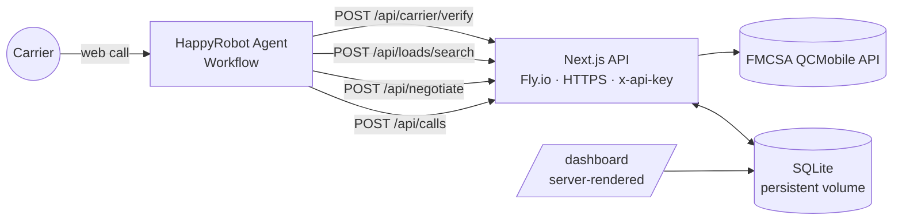
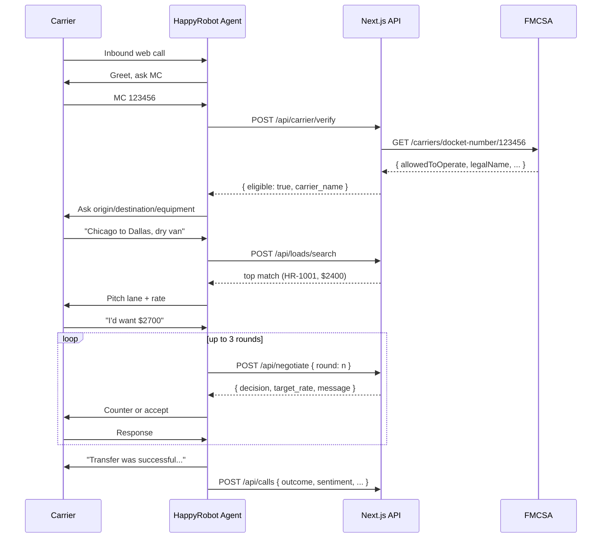

# Architecture

## High-level



## Call flow



## Components

| Layer | Responsibility | Key files |
|---|---|---|
| HappyRobot workflow | Conversation, extraction, classification | (configured in HappyRobot UI) |
| API gateway | Auth (`x-api-key`), routing | `src/lib/auth.ts`, `src/app/api/**/route.ts` |
| Domain logic | FMCSA verification, negotiation policy | `src/lib/fmcsa.ts`, `src/lib/negotiate.ts` |
| Persistence | SQLite (loads + calls) | `src/lib/db.ts`, `scripts/seed.ts` |
| Read model | Dashboard (server components) | `src/app/dashboard/page.tsx`, `src/components/dashboard/*` |
| Delivery | Docker + Fly.io | `Dockerfile`, `fly.toml` |

## Data model

```
loads
  load_id PK
  origin, destination
  pickup_datetime, delivery_datetime
  equipment_type
  loadboard_rate
  notes, weight, commodity_type, num_of_pieces, miles, dimensions

calls
  id PK
  created_at
  mc_number, carrier_name
  load_id FK -> loads
  outcome           (accepted | rejected | no_match | ineligible | abandoned)
  sentiment         (positive | neutral | negative)
  final_rate, loadboard_rate
  num_rounds
  summary
```

## Trust boundaries

- The HappyRobot agent → API edge is the only authenticated boundary. Everything else (FMCSA, SQLite) is server-internal.
- The dashboard reads SQLite directly via server components — no client-side credentials.
- Secrets (`API_KEY`, `FMCSA_WEBKEY`) live in Fly secrets and `.env` (gitignored).
